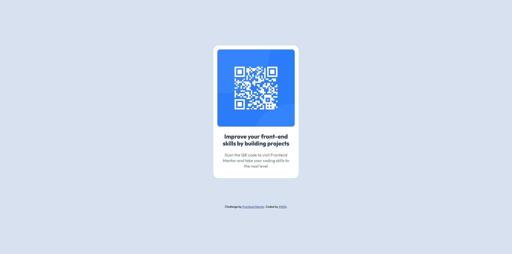

This is a solution to the [QR code component challenge on Frontend Mentor](https://www.frontendmentor.io/challenges/qr-code-component-iux_sIO_H). Frontend Mentor challenges help you improve your coding skills by building realistic projects.

## Table of contents

- [Overview](#overview)
- [Screenshot](#screenshot)
- [My Process](#my-process)
  - [Built With](#built-with)
  - [What I Learned](#what-i-learned)
  - [Continued Development](#continued-development)
- [Author](#author)
- [Acknowledgments](#acknowledgments)

## Overview

A simple QR code component built with semantic HTML and modern CSS to practice responsive design and flexbox layout.

### Screenshot

## My Process

### Built With

- Semantic HTML5 markup
- CSS Flexbox
- Responsive design principles

### What I Learned
1. **Planning Layout**: Sketching the component structure before coding helped me map out the HTML elements and CSS flex containers.
2. **Responsive Practices**: Implementing percentage-based widths and using `max-width` allowed the component to adapt across screen sizes.
3. **Flexbox Centering**: I practiced centering techniques, including `margin: auto` and parent flex containers with `justify-content` and `align-items`.

This challenge reinforced my frontend fundamentals and gave me confidence in my project setup routine.

### Continued Development

I plan to explore advanced CSS features like CSS Grid and custom properties to further enhance layout flexibility.

## Author

- **Me 😁** - [GitHub Profile](https://github.com/imagineBillie)

## Acknowledgments

- Thanks to Frontend Mentor for the challenge prompts and support.

